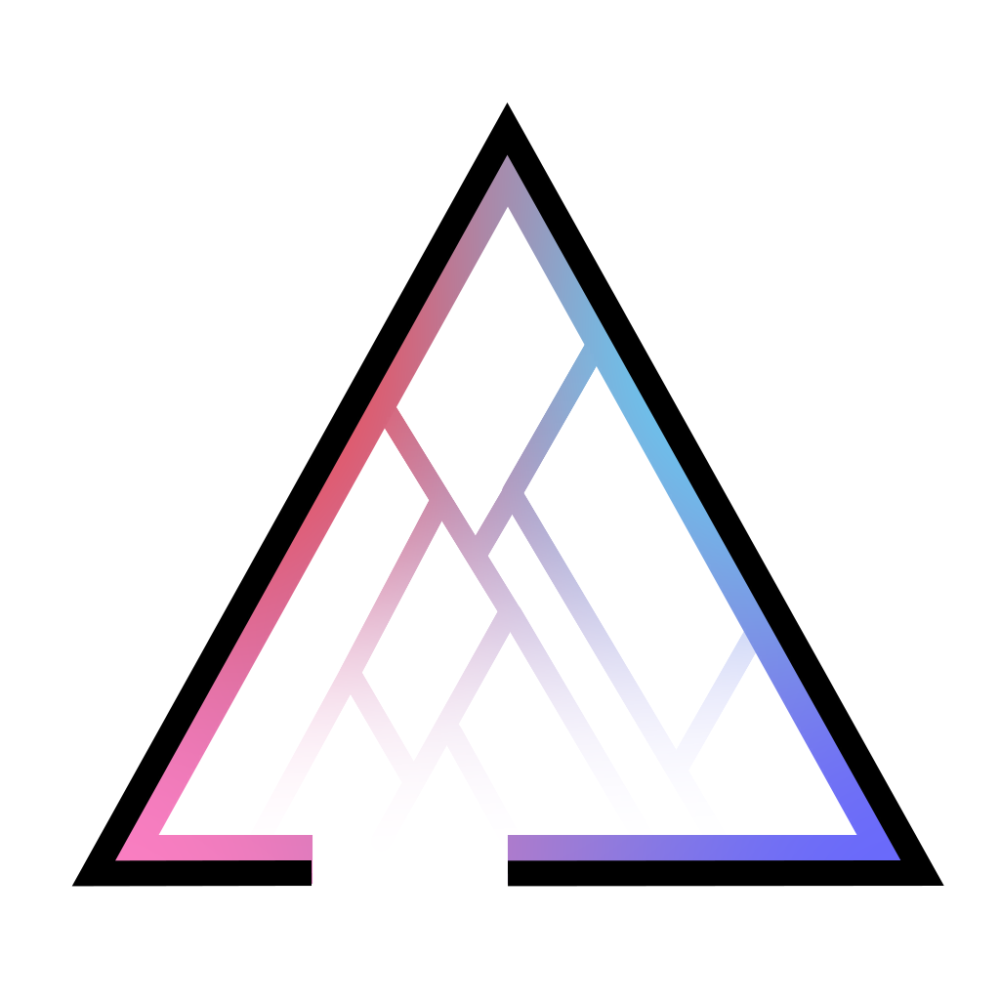

# Delta framework



#### What's inside
There are 2 kinds of directories in the repository : 
- /framework/ contains the framework itself 
- /xxxx_server/  and /xxxx_client/ contain the server and client sides of the instanced framework application named xxxx.

Both a server and a client need to run for a game to be started. The framework itself can't be launched.
It needs to be instanciated. Several examples have been implemented :
- Stgy     : a strategy game (implemented in node and partially in scalajs)
- Chps     : a cooperative pirate-ship game
- Paint    : a multi-user paint
- Splash   : a shooter game inspired by Splatoon.
- Demo     : the most basic game that shows how the framework works

[](https://www.youtube.com/watch?v=iEowDWPnvx4)

#### How to run the framework 

##### Requirements
- [Node] v6.10.0 LTS
- [Scala] v2.12.1
- [SBT] v0.13

##### Procedure

With Intellij :
Open the \demo_server\src\main\scala\demo directory. Launch Demo.scala.

Then with Node in the \demo_client\ directory, write in a command line :
```sh
$ npm install
$ npm start
```

Open [localhost:5000].

   [SBT]:<http://www.scala-sbt.org/download.html>
   [Node]:<https://nodejs.org/en/>
   [Scala]:<https://www.scala-lang.org>
   [localhost:5000]: <http://localhost:5000>
  
